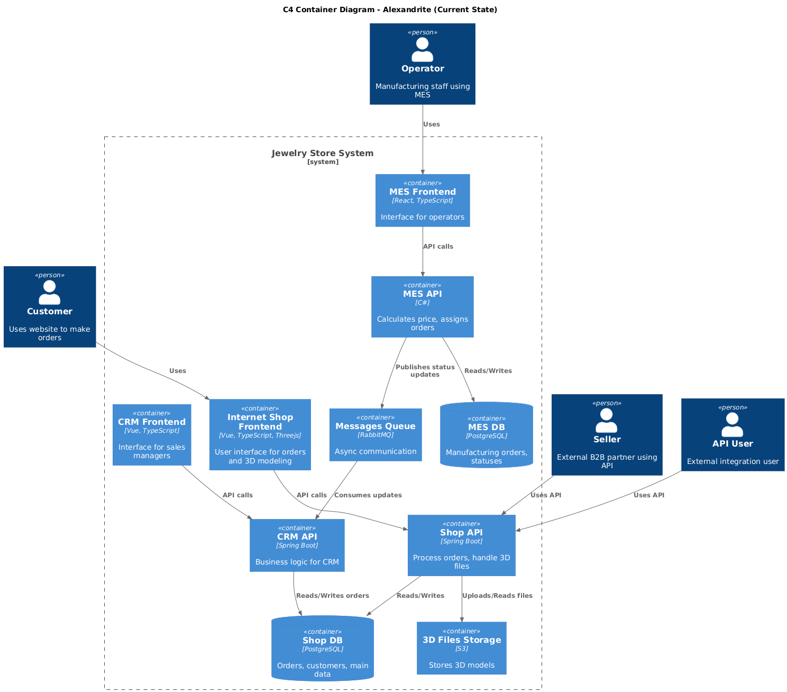
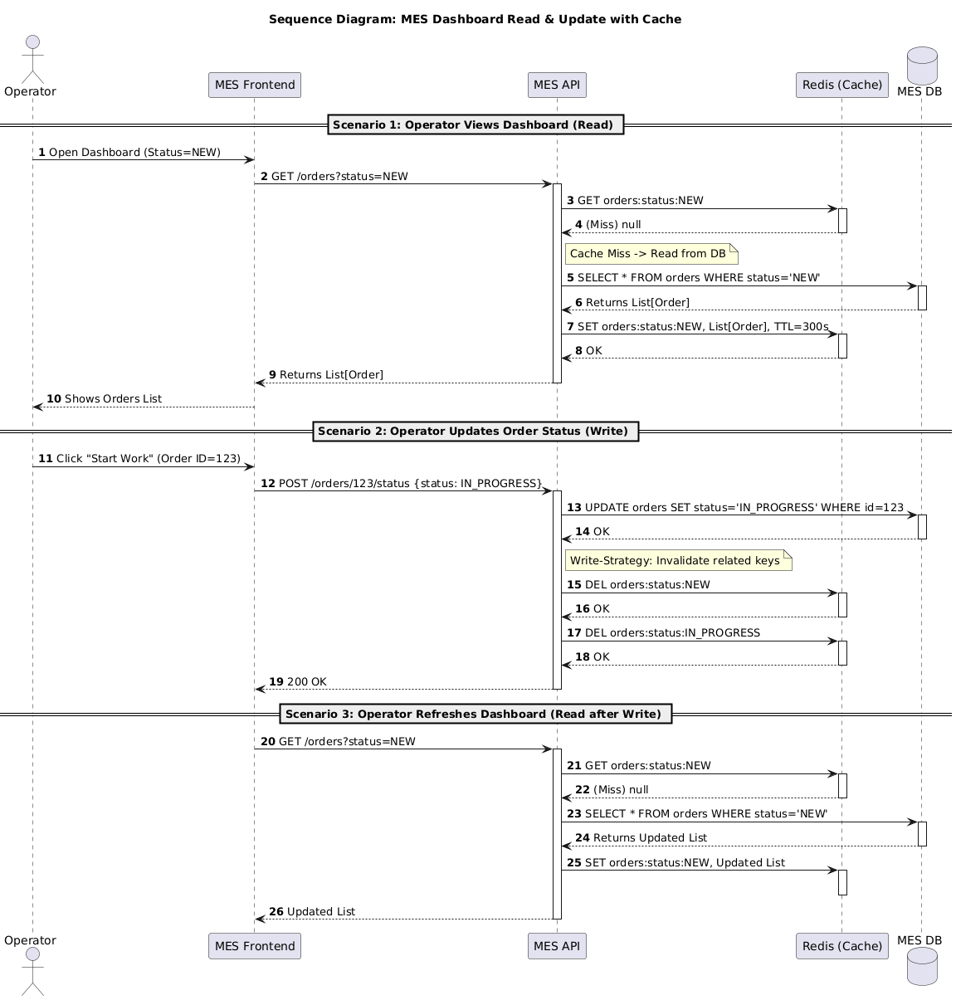
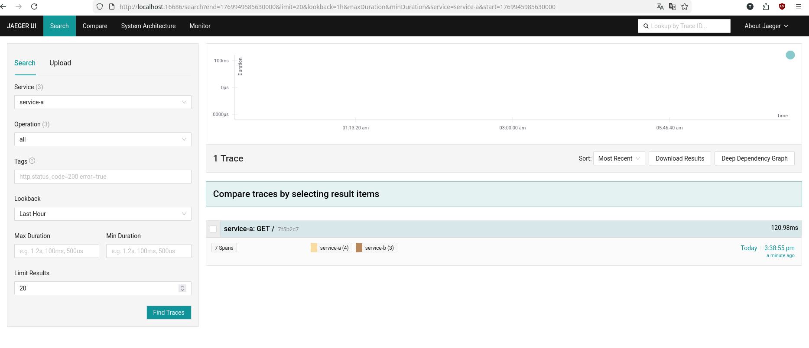

# Проектная работа: Спринт 6 (High Load & Observability)

Репозиторий содержит решение проектной работы для кейса компании «Александрит». 
Основной фокус спринта — повышение **отказоустойчивости** (Resilience) и внедрение **наблюдаемости** (Observability) для растущей системы.

## 📂 Структура проекта

Решение разбито на 5 заданий, каждое в своей директории:

| Директория | Описание задачи | Артефакты |
|------------|-----------------|-----------|
| **[Task 1](./Task1)** | Анализ текущей архитектуры, выявление проблем (SPOF, Performance) и план инициатив. | [📄 Анализ и план](./Task1/Планирование_анализ_идентификация_проблем_и_поиск_решений.md) |
| **[Task 2](./Task2)** | Стратегия мониторинга (Metrics). Выбор подходов RED/USE и ключевых метрик. | [📄 Решение по мониторингу](./Task2/Выбор_и_настройка_мониторинга_в_системе.md) |
| **[Task 3](./Task3)** | Распределенный трейсинг (Tracing). Архитектура + **MVP реализация в коде**. | [📄 Решение](./Task3/Архитектурное_решение_по_трейсингу.md), [💻 Код (K8s/Python)](./Task3), [📸 Скриншот работы](./Task3/trace_evidence.png) |
| **[Task 4](./Task4)** | Централизованное логирование (Logging). ELK/OpenSearch стек и политики безопасности. | [📄 Решение по логированию](./Task4/Архитектурное_решение_по_логированию.md) |
| **[Task 5](./Task5)** | Кеширование (Caching). Ускорение MES и Магазина с помощью Redis. | [📄 Решение по кешированию](./Task5/Архитектурное_решение_по_кешированию.md) |

---

## 🏗 Архитектура "As Is"
Текущее состояние системы (микросервисы, базы данных и связи):



---

## 🚀 Детали реализации

### 1. Отказоустойчивость и Кеширование (Task 5)
Для решения проблемы медленного MES-дашборда и высокой нагрузки на БД предложен паттерн **Cache-Aside** с комбинированной стратегией инвалидации.



### 2. Трейсинг и Observability (Task 3)
В рамках задания 3.1 был реализован MVP распределенного трейсинга:
*   Развернут **Jaeger** в Kubernetes (Minikube).
*   Написаны два микросервиса на **Python (FastAPI)**.
*   Настроена авто-инструментация через **OpenTelemetry**.

**Подтверждение работы (Скриншот Jaeger UI):**


#### Как запустить MVP локально:
```bash
# 1. Запуск Minikube
minikube start --addons=ingress

# 2. Установка Jaeger
kubectl create namespace observability
kubectl apply -f Task3/k8s/jaeger-instance.yaml -n observability

# 3. Сборка и деплой сервисов
eval $(minikube docker-env)
docker build -t service-a:latest Task3/services/service-a/
docker build -t service-b:latest Task3/services/service-b/
kubectl apply -f Task3/k8s/services.yaml

# 4. Проверка
kubectl port-forward svc/simplest-query -n observability 16686:16686
# UI доступен по адресу http://localhost:16686
