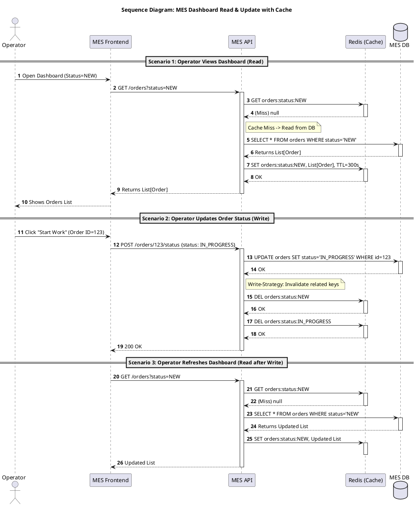

# Архитектурное решение по кешированию

## Контекст проблемы

MES-система «Александрит» испытывает серьёзные проблемы с производительностью. Операторы жалуются на долгую загрузку дашборда с заказами. Команда уже внедрила фильтры по статусам и пагинацию на фронтенде, но это не помогло — корень проблемы на стороне бэкенда и базы данных.

Параллельно онлайн-магазин (Shop) обслуживает растущий поток B2B и B2C клиентов, что создаёт дополнительную нагрузку на Shop DB, к которой также обращается CRM.

---

## Мотивация

### Почему необходимо внедрить кеширование

**1. Критическая деградация UX для операторов**

Дашборд MES — основной рабочий инструмент операторов. От скорости его работы напрямую зависит:
- Производительность операторов (кто быстрее видит заказ — тот его берёт и получает оплату).
- Throughput производства в целом.
- Мотивация команды (работать с «тормозящей» системой демотивирует).

**2. Неэффективное использование ресурсов БД**

Каждый раз, когда оператор открывает дашборд или обновляет страницу, выполняется тяжёлый SQL-запрос к MES DB. При 10 операторах, обновляющих страницу каждые 30 секунд, получаем 20 запросов в минуту на один и тот же набор данных, который меняется редко.

**3. Единственный инстанс БД — узкое место**

MES DB обслуживает и чтение (дашборд), и запись (изменение статусов). Тяжёлые read-запросы конкурируют с write-операциями, создавая взаимные блокировки.

**4. Рост нагрузки на Shop**

Каталог товаров запрашивается при каждом посещении сайта. При линейном росте в +100 заказов/месяц нагрузка на Shop DB будет только увеличиваться.

### Какие проблемы решит кеширование

| Проблема | Как решает кеширование |
|----------|------------------------|
| Медленный дашборд MES | Данные отдаются из памяти Redis за ~1 мс вместо 100–500 мс из БД |
| Высокая нагрузка на MES DB | 90%+ read-запросов не дойдут до БД |
| Конкуренция read/write | Read-трафик уходит в Redis, БД обслуживает преимущественно write |
| Нагрузка на Shop при росте | Каталог кешируется, БД разгружается |

---

## Предлагаемое решение

### Элементы системы, включаемые в кеширование

#### 1. MES Dashboard — список заказов по статусам (Критический приоритет)

**Что кешируем:** Результаты запросов списков заказов с фильтрацией по статусу.

**Тип кеширования:** Серверное (Redis).

**Паттерн:** Cache-Aside (Lazy Loading).

**Обоснование выбора Cache-Aside:**

| Паттерн | Подходит? | Почему |
|---------|-----------|--------|
| **Cache-Aside** | ✅ Да | Приложение контролирует логику. Кешируем только то, что запрашивают. При падении Redis система продолжает работать (деградация, не отказ). |
| Write-Through | ❌ Нет | Избыточен для read-heavy сценария. Усложняет код без явной выгоды. |
| Write-Behind | ❌ Нет | Риск потери данных при сбое. Не подходит для критичных бизнес-данных (статусы заказов). |
| Refresh-Ahead | ⚠️ Частично | Мог бы подойти для предотвращения cold start, но добавляет сложность. Можно рассмотреть как оптимизацию v2. |

**Структура ключей:**
```
orders:status:{STATUS}           # Список заказов по статусу
orders:status:{STATUS}:page:{N}  # Если нужна пагинация в кеше
orders:operator:{ID}             # Заказы конкретного оператора (опционально)
```

#### 2. Shop Catalog — каталог товаров (Высокий приоритет)

**Что кешируем:** Список товаров, карточки товаров, цены.

**Тип кеширования:** Серверное (Redis) + клиентское (HTTP Cache).

**Паттерн:** Cache-Aside.

**Обоснование:** Каталог меняется редко (добавление нового товара, изменение цены — события нечастые). Данные одинаковы для всех пользователей. Идеальный кандидат для агрессивного кеширования.

**Структура ключей:**
```
catalog:products:list            # Полный список товаров
catalog:product:{ID}             # Карточка конкретного товара
catalog:categories               # Список категорий
```

#### 3. 3D-модели и статические ресурсы (Средний приоритет)

**Что кешируем:** Файлы 3D-моделей, изображения товаров.

**Тип кеширования:** Клиентское (HTTP Caching) + CDN.

**Обоснование:** Это тяжёлые бинарные файлы. Хранить их в Redis неэффективно (память дорогая). Правильное решение — HTTP-заголовки (`Cache-Control`, `ETag`) и CDN перед S3.

**Реализация:**
```
Cache-Control: public, max-age=31536000, immutable
ETag: "hash-of-file-content"
```

При изменении файла — меняем URL (versioned URLs), старый остаётся в кеше клиентов, новый запрашивается.

### Почему не клиентское кеширование для MES?

| Критерий | Клиентское | Серверное (Redis) |
|----------|------------|-------------------|
| Консистентность между операторами | ❌ Каждый видит своё | ✅ Единый источник |
| Инвалидация при изменении статуса | ❌ Сложно/невозможно | ✅ Централизованно |
| Эффект при первом запросе | ❌ Нет | ✅ Работает для всех |
| Снижение нагрузки на БД | ⚠️ Частичное | ✅ Полное |

**Вывод:** Для MES-дашборда критична консистентность между операторами и возможность мгновенной инвалидации. Только серверное кеширование.

---

## Стратегия инвалидации кеша

### Выбранная стратегия: Комбинированная (TTL + Explicit Invalidation)

Для MES-дашборда используем **гибридный подход**:

1. **TTL (Time To Live) = 5 минут** — страховочный механизм. Даже если explicit invalidation не сработает, данные не будут устаревшими более 5 минут.

2. **Explicit Invalidation при изменении статуса** — при любом изменении статуса заказа инвалидируем связанные ключи кеша.

### Сравнение стратегий инвалидации

| Стратегия | Подходит для MES? | Плюсы | Минусы |
|-----------|-------------------|-------|--------|
| **Только TTL** | ⚠️ Частично | Простота реализации | Оператор может видеть устаревшие данные до 5 минут. Критично: нажал "Взять в работу", обновил страницу — заказ всё ещё "Новый". |
| **Только Explicit** | ⚠️ Рискованно | Данные всегда актуальны | При ошибке в коде кеш никогда не обновится. Race conditions. |
| **TTL + Explicit** | ✅ Оптимально | Баланс консистентности и надёжности | Чуть сложнее в реализации |
| **Event-based (Pub/Sub)** | ⚠️ Overkill | Реактивность | Избыточная сложность для текущего масштаба |

### Логика инвалидации для MES

При изменении статуса заказа (например, `NEW` → `IN_PROGRESS`):

```python
def update_order_status(order_id: int, new_status: str):
    old_status = db.get_order_status(order_id)
    
    # 1. Обновляем в БД
    db.update_order_status(order_id, new_status)
    
    # 2. Инвалидируем кеш ОБОИХ статусов
    cache.delete(f"orders:status:{old_status}")
    cache.delete(f"orders:status:{new_status}")
    
    # 3. Публикуем событие в RabbitMQ (для CRM)
    rabbitmq.publish("order.status.changed", {...})
```

**Почему удаляем оба ключа:**
- `orders:status:NEW` — заказ ушёл из этого списка
- `orders:status:IN_PROGRESS` — заказ появился в этом списке

### Инвалидация для Shop Catalog

Для каталога достаточно **только TTL = 1 час**:
- Изменения редки (новый товар, изменение цены).
- Задержка в 1 час некритична для бизнеса.
- При срочном обновлении можно вручную сбросить ключ через админку.

---

## Диаграмма последовательности действий

### MES Dashboard: чтение списка заказов и обновление статуса



**Пояснение к диаграмме:**

**Сценарий 1 (Read — Cache Miss):** Оператор открывает дашборд. Кеш пуст, запрос идёт в БД. Результат сохраняется в Redis с TTL=300 секунд.

**Сценарий 2 (Write — Invalidation):** Оператор меняет статус заказа. После записи в БД инвалидируются оба затронутых ключа кеша (старый и новый статус).

**Сценарий 3 (Read after Write):** При следующем запросе кеш пуст (был инвалидирован), данные снова читаются из БД — уже актуальные.

---

## Риски и митигация

### Thundering Herd Problem

**Риск:** При истечении TTL или инвалидации множество операторов одновременно запрашивают данные → все идут в БД → перегрузка.

**Митигация:**
1. **Mutex/Lock при cache miss:** Первый поток ставит lock, остальные ждут. Только один запрос идёт в БД.
2. **Stale-while-revalidate:** Отдавать устаревшие данные, пока фоновый процесс обновляет кеш.

### Падение Redis

**Риск:** Redis недоступен, все запросы идут в БД.

**Митигация:**
1. **Circuit Breaker:** При N ошибок Redis — временно перестаём пытаться, идём сразу в БД.
2. **Redis Sentinel/Cluster:** High Availability конфигурация Redis.
3. **Graceful degradation:** Система продолжает работать, просто медленнее.

### Консистентность при race conditions

**Риск:** Между `UPDATE` в БД и `DEL` в кеше другой процесс читает устаревшие данные и кладёт их обратно в кеш.

**Митигация:**
1. Инвалидировать кеш **до** записи в БД (delete-before-write). Риск: если запись упадёт, кеш всё равно инвалидирован (не страшно, просто cache miss).
2. Использовать версионирование ключей.

---

## Технологический стек

| Компонент | Технология | Обоснование |
|-----------|------------|-------------|
| Cache Store | **Redis** (Yandex Managed Redis) | In-memory, sub-millisecond latency, поддержка TTL, широкая ecosystem |
| Клиент (Java/Spring) | **Spring Cache + Lettuce** | Нативная интеграция, аннотации `@Cacheable`, `@CacheEvict` |
| Клиент (C#) | **StackExchange.Redis** | De-facto стандарт для .NET |
| CDN для статики | **Yandex CDN** | Уже в облаке Yandex, простая интеграция с S3 |

---

## План внедрения

| Этап | Задача | Срок | Ответственный |
|------|--------|------|---------------|
| 1 | Развернуть Managed Redis в Yandex Cloud | 1 день | DevOps |
| 2 | Интегрировать Redis в MES API (C#), добавить кеширование списка заказов | 3–5 дней | C# разработчик |
| 3 | Добавить инвалидацию при смене статуса | 1–2 дня | C# разработчик |
| 4 | Мониторинг: hit rate, latency, memory usage | 1 день | DevOps |
| 5 | Нагрузочное тестирование | 2 дня | QA |
| 6 | Деплой в prod, наблюдение | 1 день | Команда |

**Общий срок:** ~2 недели (1 спринт).

---

## Ожидаемые результаты

| Метрика | До | После (ожидание) |
|---------|-----|------------------|
| Время загрузки дашборда MES | 2–5 секунд | < 200 мс |
| Нагрузка на MES DB (read) | 100% | ~10–20% |
| Cache Hit Rate | — | > 90% |
| Удовлетворённость операторов | Низкая | Высокая |

---

## Резюме

Внедрение серверного кеширования на базе Redis с паттерном Cache-Aside и комбинированной стратегией инвалидации (TTL + Explicit) позволит:

1. **Радикально ускорить** работу MES-дашборда (в 10–25 раз).
2. **Снизить нагрузку** на базу данных, освободив ресурсы для write-операций.
3. **Повысить отказоустойчивость** — при проблемах с Redis система деградирует, но не падает.
4. **Заложить фундамент** для дальнейшего масштабирования системы.

Решение реализуемо силами текущей команды за один спринт без привлечения дополнительных ресурсов.
